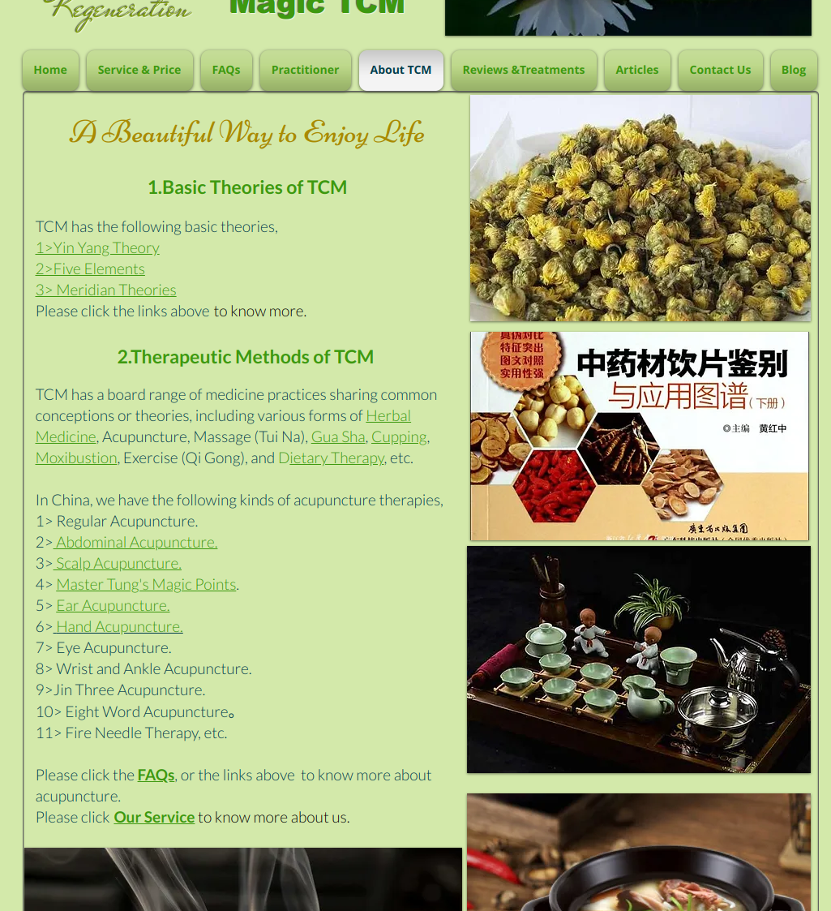
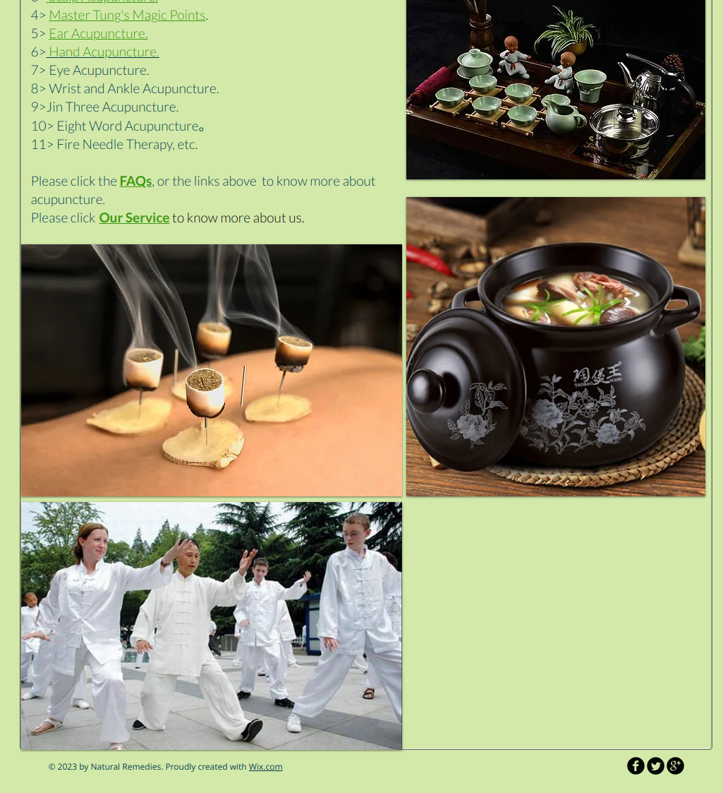

A Beautiful Way to Enjoy Life
1. Basic Theories of TCM
TCM has the following basic theories,
- <a href = "Text/YinYang and Five Elements.md"> Yin Yang Theory </a>
- <a href = "Text/YinYang and Five Elements.md"> Five Elements </a>
- Meridian Theories

菊花.jpg
1. Therapeutic Methods of TCM
TCM has a board range of medicine practices sharing common conceptions or theories, including various forms of Herbal Medicine, Acupuncture, Massage (Tui Na), Gua Sha, Cupping, Moxibustion, Exercise (Qi Gong), and Dietary Therapy, etc.

In China, we have the following kinds of acupuncture therapies,

1. Regular Acupuncture.
2. Abdominal Acupuncture.
3. Scalp Acupuncture.
4. Master Tung's Magic Points.
5. Ear Acupuncture.
6. Hand Acupuncture.
7. Eye Acupuncture.
8. Wrist and Ankle Acupuncture.
9.  Jin Three Acupuncture.
10. Eight Word Acupuncture。
11. Fire Needle Therapy, etc.

Please click the FAQs, or the links above  to know more about acupuncture.

Please click Our Service to know more about us.

