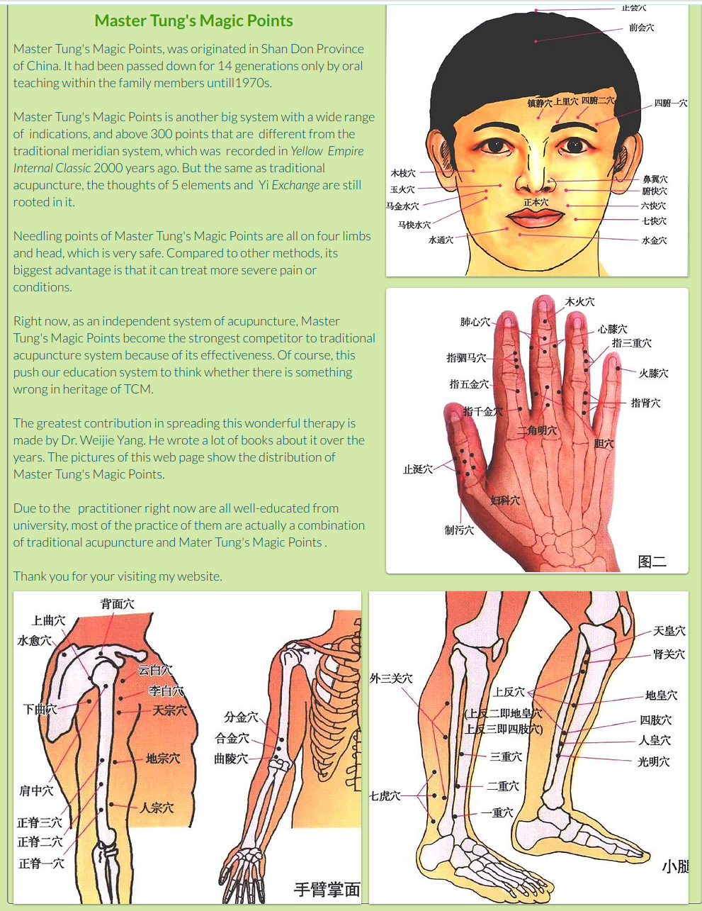

Master Tung's Magic Points
Master Tung's Magic Points, was originated in Shan Don Province of China. It had been passed down for 14 generations only by oral teaching within the family members untill1970s.

Master Tung's Magic Points is another big system with a wide range of  indications, and above 300 points that are  different from the traditional meridian system, which was  recorded in Yellow  Empire Internal Classic 2000 years ago. But the same as traditional acupuncture, the thoughts of 5 elements and  Yi Exchange are still rooted in it.

Needling points of Master Tung's Magic Points are all on four limbs and head, which is very safe. Compared to other methods, its biggest advantage is that it can treat more severe pain or conditions. 
​
Right now, as an independent system of acupuncture, Master Tung's Magic Points become the strongest competitor to traditional acupuncture system because of its effectiveness. Of course, this push our education system to think whether there is something wrong in heritage of TCM.

The greatest contribution in spreading this wonderful therapy is made by Dr. Weijie Yang. He wrote a lot of books about it over the years. The pictures of this web page show the distribution of  Master Tung's Magic Points. 

Due to the   practitioner right now are all well-educated from university, most of the practice of them are actually a combination of traditional acupuncture and Mater Tung's Magic Points .

Thank you for your visiting my website.

