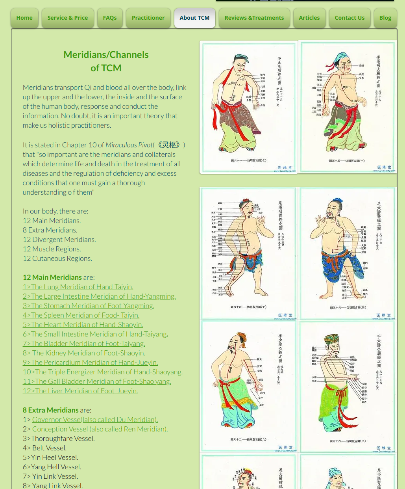
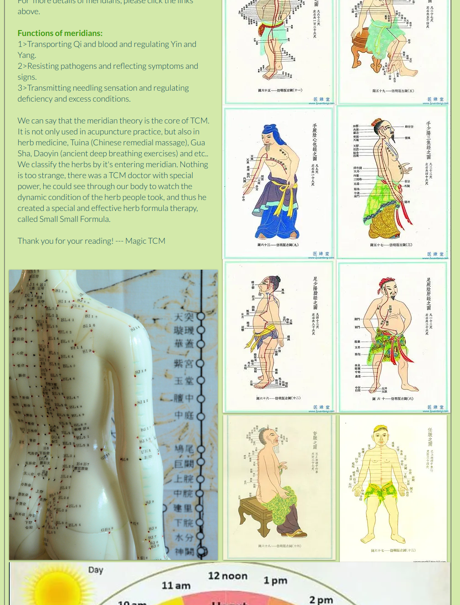

# Meridians/Channels
of TCM
Meridians transport Qi and blood all over the body, link up the upper and the lower, the inside and the surface of the human body, response and conduct the information. No doubt, it is an important theory that make us holistic practitioners.

It is stated in Chapter 10 of Miraculous Pivot(《灵枢》) that "so important are the meridians and collaterals which determine life and death in the treatment of all diseases and the regulation of deficiency and excess conditions that one must gain a thorough understanding o f them"

In our body, there are:
12 Main Meridians.
8 Extra Meridians.
12 Divergent Meridians.
12 Muscle Regions.
12 Cutaneous Regions.

12 Main Meridians are:
1. The Lung Meridian of Hand-Taiyin.
2. The Large Intestine Meridian of Hand-Yangming.
3.  The Stomach Meridian of Foot-Yangming.
4. The Spleen Meridian of Food- Taiyin.
5. The Heart Meridian of Hand-Shaoyin.
6. The Small Intestine Meridian of Hand-Taiyang.
7. The Bladder Meridian of Foot-Taiyang.
8.  The Kidney Meridian of Foot-Shaoyin.
9.  The Pericardium Meridian of Hand-Jueyin.
10. The Triple Energizer Meridian of Hand-Shaoyang.
11. The Gall Bladder Meridian of Foot-Shao yang.
12. The Liver Meridian of Foot-Jueyin.

8 Extra Meridians are:
1. Governor Vesse(lalso called Du Meridian).
2. Conception Vessel (also called Ren Meridian).
3. Thoroughfare Vessel.
4. Belt Vessel.
5. Yin Heel Vessel.
6. Yang Hell Vessel.
7. Yin Link Vessel.
8. Yang Link Vessel.

For  more details of meridians, please click the links above.

Functions of meridians:

1. Transporting Qi and blood and regulating Yin and Yang.

2. Resisting pathogens and reflecting symptoms and signs.

3. Transmitting needling sensation and regulating deficiency and excess conditions.

​We can say that the meridian theory is the core of TCM. It is not only used in acupuncture practice, but also in herb medicine, Tuina (Chinese remedial massage), Gua Sha, Daoyin (ancient deep breathing exercises) and etc.. We classify the herbs by it's entering meridian. Nothing is too strange, there was a TCM doctor with special power, he could see through our body to watch the dynamic condition of the herb people took, and thus he created a special and effective herb formula therapy, called Small Small Formula.
Thank you for your reading! --- Magic TCM

# Lung Meridian of Hand Tai Yin
The Lung Meridians of Hand Taiyin originates from the middle energizer, running downward to connect with the large intestine(1). Wind back, it goes along the upper orifice of the stomach (2),passes through the diaphragm(3), and enters the lung, its pertaining organ(4). From the lung system, which refers to the portion of the lung communicating with the throat, it comes out transversely (Zhongfu, LU)(5).Desending along the medial aspect of the upper arm, it passes in front of the Heart Meridian of Hand-Shaoyin and the pericardium Meridian of Hand-Jueyin(6), and reaches the cubital fossa (7). Then it goes continuously downward along the anterior border of the radial side in the medial aspect of forearm(8) and enters cunkou (the radial artery at the wrist for pulse palpitation)(9).Passing the thenar eminence (10), it goes along its radial border (11),ending at the medial side of the tip of the thumb (Shaoshang, Lu11)(12).

The branch proximal to the wrist emerges from Lieque (LU7)(13), and runs directly to the radial side of the tip of the index finger (Shangyang, Lu1) where it links with the Large Intestine Meridians of Hand-Yangming.

# Large Intestine Meridian of Hand Yangming
The Lung Meridians of Hand Taiyin originates from the middle energizer, running downward to connect with the large intestine(1). Wind back, it goes along the upper orifice of the stomach (2),passes through the diaphragm(3), and enters the lung, its pertaining organ(4). From the lung system, which refers to the portion of the lung communicating with the throat, it comes out transversely (Zhongfu, LU)(5).Desending along the medial aspect of the upper arm, it passes in front of the Heart Meridian of Hand-Shaoyin and the pericardium Meridian of Hand-Jueyin(6), and reaches the cubital fossa (7). Then it goes continuously downward along the anterior border of the radial side in the medial aspect of forearm(8) and enters cunkou (the radial artery at the wrist for pulse palpitation)(9).Passing the thenar eminence (10), it goes along its radial border (11),ending at the medial side of the tip of the thumb (Shaoshang, Lu11)(12).

The branch proximal to the wrist emerges from Lieque (LU7)(13), and runs directly to the radial side of the tip of the index finger (Shangyang, Lu1) where it links with the Large Intestine Meridians of Hand-Yangming.

# Stomach Meridian of Foot -Yangming
The Stomach Meridian of Foot-Yangming starts from the lateral side of ala nasi (Yingxiang, LI20)(1). It ascends to the bridge of the nose, where it meets the Bladder Meridian of Foot-Taiyang (Jingming ST1)(2). Turning down-ward along the lateral side of nose (chengqi, ST1)(3), it enters the upper gum(4), Reemerging, it curves around the lips(5), and descends to meet the Conception Vessel at the mentolabial groove (Chengjiang, CV24)(6). Then it runs posterolaterally across the lower portion of the cheek at Daying(ST5)(7).Winding along the angle of the mandible (Jiache, ST6)(8), It ascends in the front of the ear and traverses Shangguan (GB3)(9). Then it follows the anterior hairline(10) and reaches the forehead (11).

The facial branch emerging in front of Daying (ST 5) runs downward to Renying (ST 9)(12). From there it goes along the throat and enters the supraclavicular fossa (13). Descending, it passes through the diaphragm (14), enters the stomach， its pertaining organ and connects with the spleen (15).

The straight portion of the meridian arising from the supraclavicular fossa runs downward (16), passing through the nipple, it descends by the umbilicus and enters Qichong (ST 30) on the lateral side of the lower abdomen (17).

The branch from the lower orfice of the stomach (18) descends inside the abdomen and joins the previous portion of the merdian at Qichong (ST 30). Running downward, transversing Biguan (ST31)(19), and further through Femur-Futu (ST32) (20), it reaches the Knee (21). From there, it continues downward ndalong the anterior border of the lateral aspect of the tibia (22),passes through the dorsum of the foot (23), and reaches the lateral side of the tip of the 2nd toe (Lidui, ST45) (24).

The tibia branch  emerges from Zu-sanli (ST36), 3 cun below the knee (25), and enters the lateral side of the middle toe (26).

The branch from the dorsum of the foot arises from the Chongyang (ST42) (27) and terminates at the medial side of the tip of the great toe (Yingbai, SP 1), where it links with the spleen Meridian of Foot-Taiyin.

# Spleen Meridian of Foot- Taiyin
The Spleen Meridian of Foot-Taiyin starts from the tip of the big toe (Yinbai, SP 1) (1). It  runs  along the medial aspect of the foot at the  junction of the  red and white skin (2), and ascends in front of the  medial malleolus (3) up to the medial aspect of the leg (4). It follows the posterior aspect of the tibia (5), crosses and goes in front of the Liver Meridian of Foot-Jueyin (6). Passing throught the anterior medial aspect of the knee and thigh(7), it enters the abdomen (8), then the spleen, its pertaining organ, and connects with the stomach(9), From there it wacends, passing through the idaohragm(10） and running alongside the esophagus(11), When it reaches the root of the tongue it spreads over its lower surface (12).

The branch fro the stomach goes upward through the diaphragm (13), and flows into the heart to link with the heart Meridian of Hand-Shaoyin (14).

