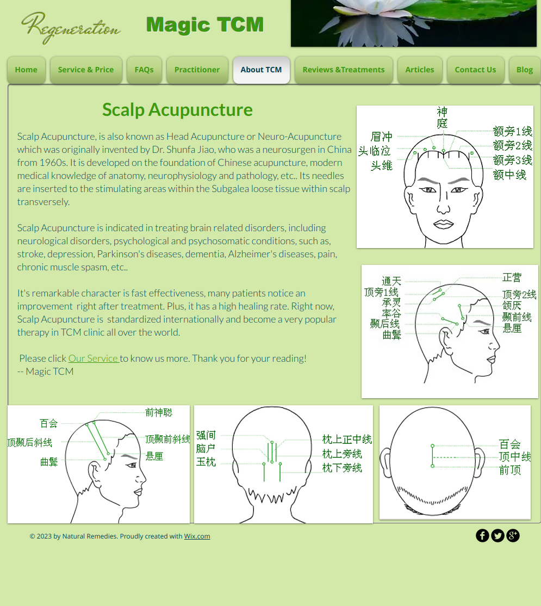

# Scalp Acupuncture
Scalp Acupuncture, is also known as Head Acupuncture or Neuro-Acupuncture which was originally invented by Dr. Shunfa Jiao, who was a neurosurgen in China from 1960s. It is developed on the foundation of Chinese acupuncture, modern medical knowledge of anatomy, neurophysiology and pathology, etc.. Its needles are inserted to the stimulating areas within the Subgalea loose tissue within scalp transversely.

​

Scalp Acupuncture is indicated in treating brain related disorders, including neurological disorders, psychological and psychosomatic conditions, such as, stroke, depression, Parkinson's diseases, dementia, Alzheimer's diseases, pain, chronic muscle spasm, etc..

​

It's remarkable character is fast effectiveness, many patients notice an improvement  right after treatment. Plus, it has a high healing rate. Right now, Scalp Acupuncture is  standardized internationally and become a very popular therapy in TCM clinic all over the world.

​

 Please click Our Service to know us more. Thank you for your reading!

-- Magic TCM

