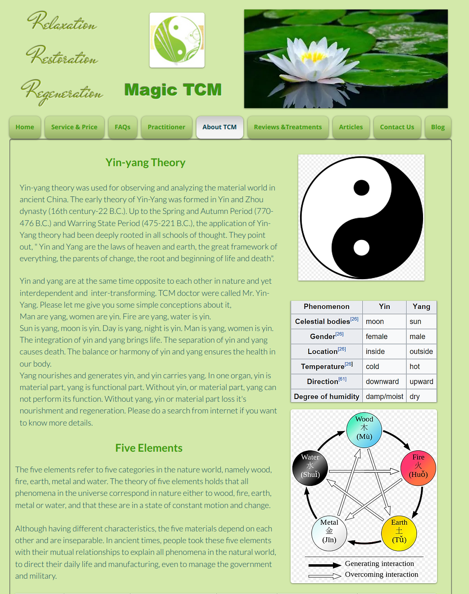
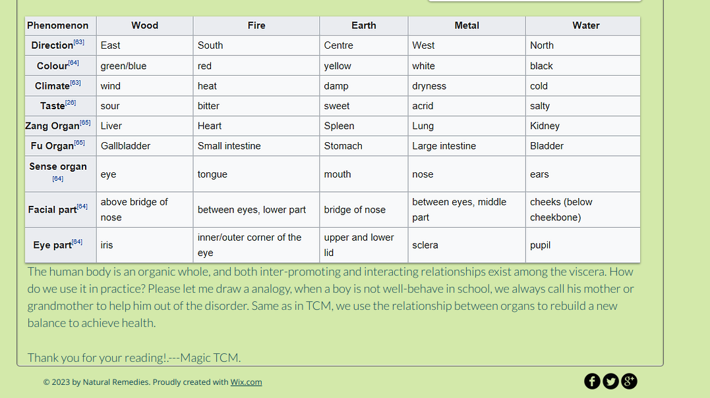

# Yin-yang Theory
Yin-yang theory was used for observing and analyzing the material world in ancient China. The early theory of Yin-Yang was formed in Yin and Zhou dynasty (16th century-22 B.C.). Up to the Spring and Autumn Period (770-476 B.C.) and Warring State Period (475-221 B.C.), the application of Yin-Yang theory had been deeply rooted in all schools of thought. They point out, " Yin and Yang are the laws of heaven and earth, the great framework of everything, the parents of change, the root and beginning of life and death".

Yin and yang are at the same time opposite to each other in nature and yet interdependent and  inter-transforming. TCM doctor were called Mr. Yin-Yang. Please let me give you some simple conceptions about it,

Man are yang, women are yin. Fire are yang, water is yin.

Sun is yang, moon is yin. Day is yang, night is yin. Man is yang, women is yin.

The integration of yin and yang brings life. The separation of yin and yang causes death. The balance or harmony of yin and yang ensures the health in our body.

Yang nourishes and generates yin, and yin carries yang. In one organ, yin is material part, yang is functional part. Without yin, or material part, yang can not perform its function. Without yang, yin or material part loss it's nourishment and regeneration. Please do a search from internet if you want to know more details.

# Five Elements
The five elements refer to five categories in the nature world, namely wood, fire, earth, metal and water. The theory of five elements holds that all phenomena in the universe correspond in nature either to wood, fire, earth, metal or water, and that these are in a state of constant motion and change.

​

Although having different characteristics, the five materials depend on each other and are inseparable. In ancient times, people took these five elements with their mutual relationships to explain all phenomena in the natural world, to direct their daily life and manufacturing, even to manage the government and military.

The human body is an organic whole, and both inter-promoting and interacting relationships exist among the viscera. How do we use it in practice? Please let me draw a analogy, when a boy is not well-behave in school, we always call his mother or grandmother to help him out of the disorder. Same as in TCM, we use the relationship between organs to rebuild a new balance to achieve health.

Thank you for your reading!.---Magic TCM.

